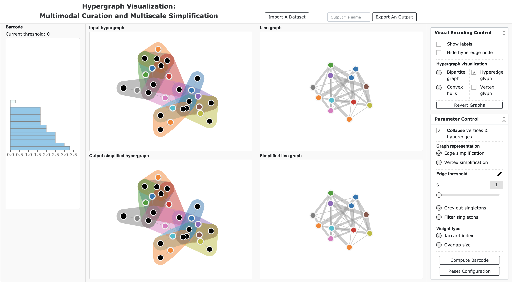

# Hypergraph Visualization via a Metric Space Viewpoint: Multimodal Curation and Multiscale Simplification

## Overview
This is the code repository for "Hypergraph Visualization via a Metric Space Viewpoint: Multimodal Curation and Multiscale Simplification"



## Live Demo
To see a live demo, go to: 

https://vis-hypergraph.herokuapp.com/

It runs on most modern web browsers. We suggest you use Google Chrome.

## Running Locally
Download or clone this repository:

```bash
git clone https://github.com/architrathore/Hypergraph-Vis.git
```

Then, run:

```bash
cd Hypergraph-Vis
python3 run.py
#Hit Ctrl+c to quit
```

You can view the page at http://0.0.0.0:6060/ (If possible, please use Chrome).

If `python3 run.py` does not work, please try `python -m flask run`.

## Requirements
This software requires [HyperNetX(>=0.2.5)](https://pnnl.github.io/HyperNetX/build/index.html), [NetworkX](https://networkx.github.io/), and [Flask](https://flask.palletsprojects.com/en/1.1.x/) to run.

If you do not have these packages installed, please use the following command to intall them.

```bash
pip install hypernetx
pip install networkx
pip install flask
```

## Importing A Hypergraph

The input data format can be CSV or TXT.

Each line of the input file should be:

```bash
hyperedge_i, vertex_i1, vertex_i2, ...
```

## Exporting An Output
When exporting a simplified hypergraph, input the file name and click on the button "Export An Output". You can find the output file in the folder `⁨Hypergraph-Vis⁩/⁨app⁩/⁨static/downloads/`.
